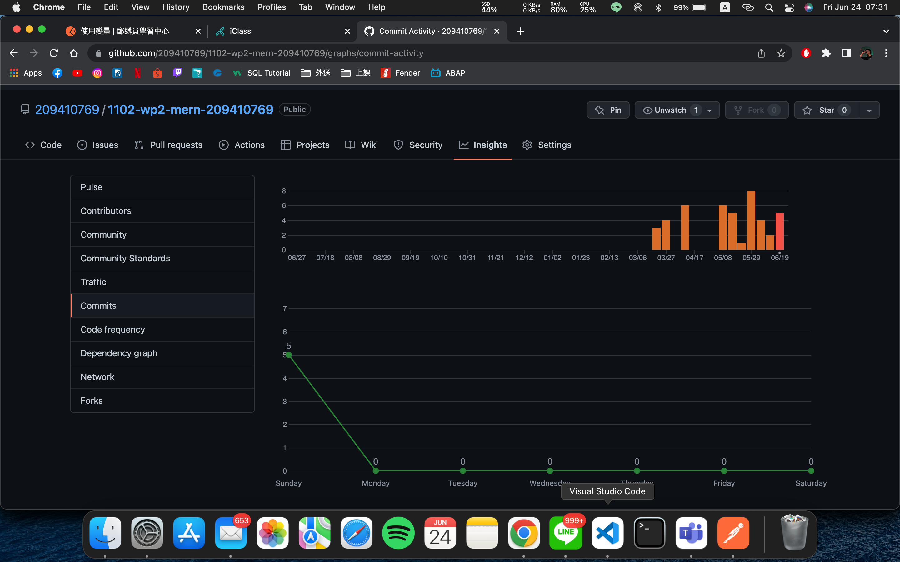

### GitHib repo Url
[GitHib repo Url](https://github.com/209410769/1102-wp2-mern-209410769)
### Github demo md URL
[W5](../W5/w5.md)
[W6](../W6/W6.md)
[W8](../W8/W8.md)
[W9](../W9/w9.md)
[W12](../W12/w12.md)
[W13](../W13/w13.md)
[W14](../W14/w14.md)
[W15](../W15/w15.md)
[W16](../W16/w16.md)
[W17](../W17/W17.md)
### GitHub log insight

### All Github Log
```
557633f 209410769       Sun Jun 19 14:26:47 2022 +0800  W17 Github Log
7962372 209410769       Sun Jun 19 14:25:39 2022 +0800  W17-P4: server authentication and updateUser
b0febaf 209410769       Sun Jun 19 13:51:02 2022 +0800  W17-P3: toggle sidebar (SmallSidebar and BigSidebar)
ec6036f 209410769       Sun Jun 19 13:19:41 2022 +0800  W17-P2: implement logout user, remove local stroage data
9e63cc9 209410769       Sun Jun 19 12:42:45 2022 +0800  W17-P1: after login in, direct to protected route of dashboard
5a9b63f 209410769       Sat Jun 18 23:05:03 2022 +0800   W16-GitHub log
e0614fb 209410769       Sat Jun 18 23:02:53 2022 +0800  W16-P3: in server, check email and password for credentials, okay then return {user, token, location}
8cdd198 209410769       Sat Jun 11 21:56:06 2022 +0800  W16-P2: loginUser from client to server, test connection okay
eb30c83 209410769       Sat Jun 11 21:51:09 2022 +0800  W16-P2: loginUser from client to server, test connection okay
7a84ccd 209410769       Thu Jun 9 22:11:13 2022 +0800   W16-1 RegisterUser Okay, Save {​ user, token, location}​ in appContext
b239a68 209410769       Sun Jun 5 21:42:49 2022 +0800   Adjustment MarkDown
4934d24 209410769       Sat Jun 4 23:12:42 2022 +0800   github log
79d546f 209410769       Sat Jun 4 23:11:27 2022 +0800   TestFetchUseProxy_69.js run 1 times
ec7ad33 209410769       Sat Jun 4 23:11:05 2022 +0800   TestFetchUseProxy_69.js run 1 times
77e1702 209410769       Sat Jun 4 23:00:51 2022 +0800   TestFetchUseCors_69.js run 1 times
e431c0a 209410769       Sat Jun 4 22:18:07 2022 +0800   W15-P1:Client / testcore to test TestFetchUseCors_69.js &  W15-P2:Client / testproxy to test TestFetchUseProxy_69.js
e525ef9 209410769       Sat Jun 4 11:05:32 2022 +0800   W14-P5 Github Log
7447cb1 209410769       Sat Jun 4 11:02:25 2022 +0800   W14-P4: Create mongodb atlas account
faf9a14 209410769       Mon May 30 15:08:56 2022 +0800  W14-P3: run server and client concurrently
e5b74a5 209410769       Thu May 26 20:11:36 2022 +0800  W14-P1: install package http-status-codes, morgan, test it, and show it & W14-P2: install express-async-errors and test it
3fd3c94 209410769       Thu May 19 22:48:55 2022 +0800  W13 Github repo URL
6480dcf 209410769       Thu May 19 22:46:57 2022 +0800  W13-P4: create jwt token using bcryptjs
f16ed88 209410769       Thu May 19 21:09:51 2022 +0800  W13-P3:Hash password using bcryptjs
66527f0 209410769       Thu May 19 20:29:17 2022 +0800  W13-P2:Use validator package to check email,error sent to error-handler_69.js
515907f 209410769       Thu May 19 19:36:18 2022 +0800  w13-P1:create a user and save it into MongoDB, collection User_69
961109c 209410769       Thu May 12 21:22:30 2022 +0800  2022-05-12 git log
8e7ab75 209410769       Thu May 12 21:19:57 2022 +0800  Use Postman to test route /api/v1/auth_69/register_69 & login_69 & updateuser_69
f0429de 209410769       Thu May 12 21:18:24 2022 +0800  Use Postman to test route /api/v1/auth_69/register_69 & login_69 & updateuser_69
cabaa01 209410769       Thu May 12 19:55:58 2022 +0800  W12-P2 test for notFoundMiddlerware_69.js & errorHandlerMiddlerware_69.js
e272a18 209410769       Thu May 12 19:23:00 2022 +0800  W12-P1 Switch Register and Login,and Log
2685b40 209410769       Thu May 12 18:28:49 2022 +0800  add W12 MD
bcf909b 209410769       Sat Apr 16 01:02:57 2022 +0800  add Class_Material
f54bc64 209410769       Sat Apr 16 01:02:41 2022 +0800  add Class_Material
d5f8b0d 209410769       Sat Apr 16 01:00:41 2022 +0800  check W08 markdown
7fe1bf5 209410769       Sat Apr 16 00:51:29 2022 +0800  Alert use reducer & appContext
4495f20 209410769       Fri Apr 15 21:37:16 2022 +0800  connect to MongoDB and add data to the demo_69.user
661f4e6 209410769       Thu Apr 14 20:05:47 2022 +0800  W08/2022/04/14 add mongodb setting
aa3b7b0 209410769       Thu Mar 31 23:15:29 2022 +0800  add Class Material to Class Demo
c624e31 209410769       Thu Mar 31 21:34:58 2022 +0800  Test e.target on Form fields (name,email,password)
0dba68c 209410769       Thu Mar 31 20:25:30 2022 +0800  add Class Material to W06 & add P3.png to W6.md
d5db1d1 209410769       Thu Mar 31 20:05:33 2022 +0800  2022-03-31 class---add Dashboard_69,/pages/index,Register_69,/components/index,/component/Logo_69
8b3c59b 209410769       Thu Mar 24 21:23:29 2022 +0800  modify week 5 markdown
ebfad8a 209410769       Thu Mar 24 21:22:47 2022 +0800  modify week 5 markdown
cf114f8 209410769       Thu Mar 24 21:12:50 2022 +0800  first commit
```