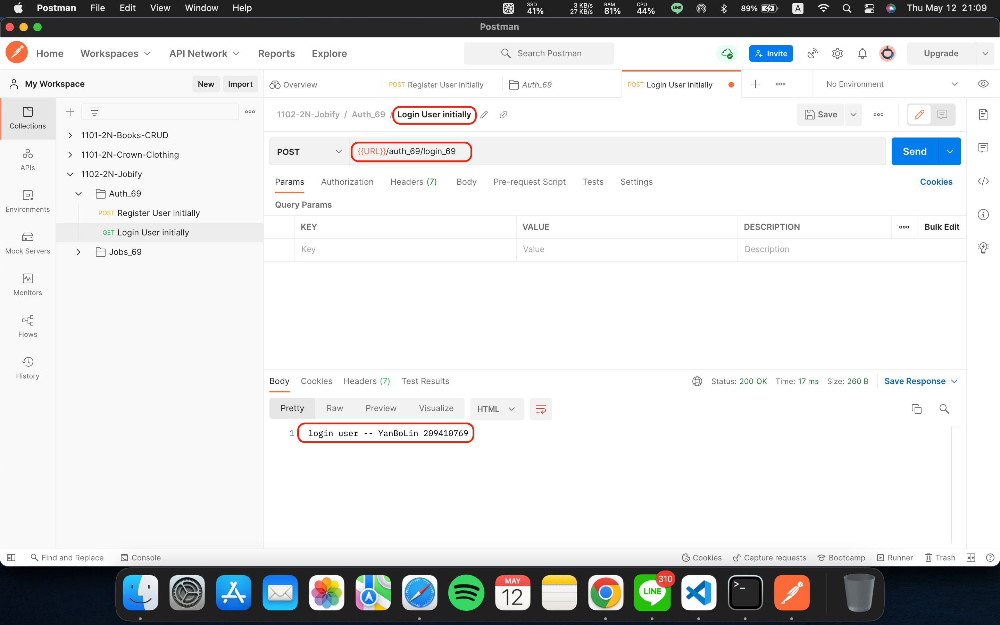

### W12-P1 Switch Register and Login


### W12-P1 Log

___
### W12-P2 test for notFoundMiddlerware_69.js

### W12-P2 test for errorHandlerMiddlerware_69.js

### W12-P2 Log

___
### W12-P3 Use Postman to test route /api/v1/auth_69/register_69


### W12-P3 Use Postman to test route /api/v1/auth_69/login_69


### W12-P3 Use Postman to test route /api/v1/auth_69/updateUser_69


### log
```
8e7ab75 209410769       Thu May 12 21:19:57 2022 +0800  Use Postman to test route /api/v1/auth_69/register_69 & login_69 & updateuser_69
f0429de 209410769       Thu May 12 21:18:24 2022 +0800  Use Postman to test route /api/v1/auth_69/register_69 & login_69 & updateuser_69
cabaa01 209410769       Thu May 12 19:55:58 2022 +0800  W12-P2 test for notFoundMiddlerware_69.js & errorHandlerMiddlerware_69.js
e272a18 209410769       Thu May 12 19:23:00 2022 +0800  W12-P1 Switch Register and Login,and Log
```