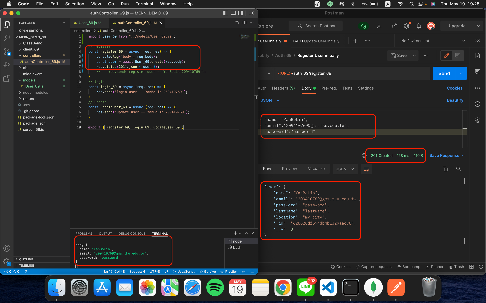
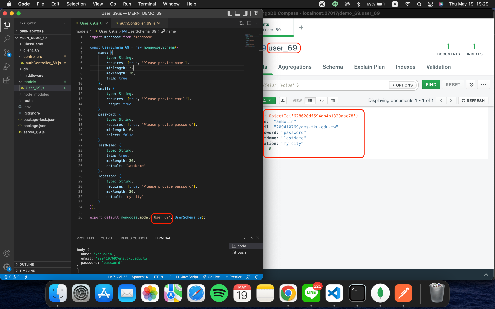
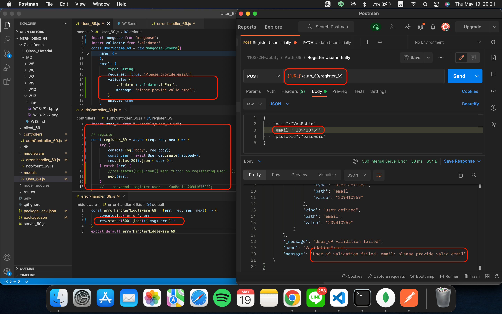
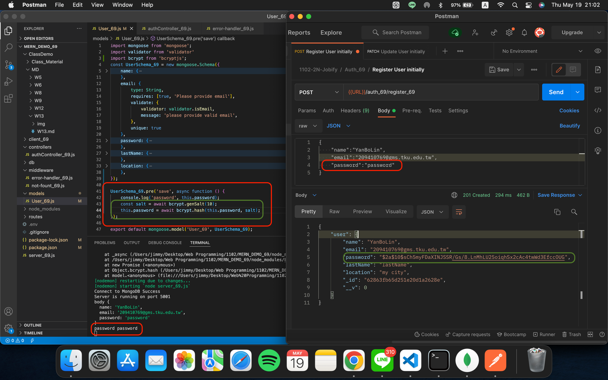
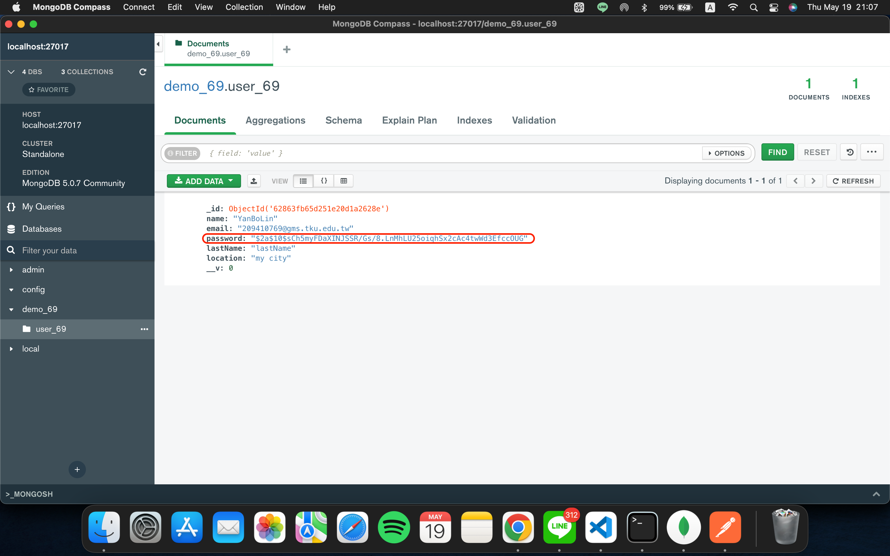
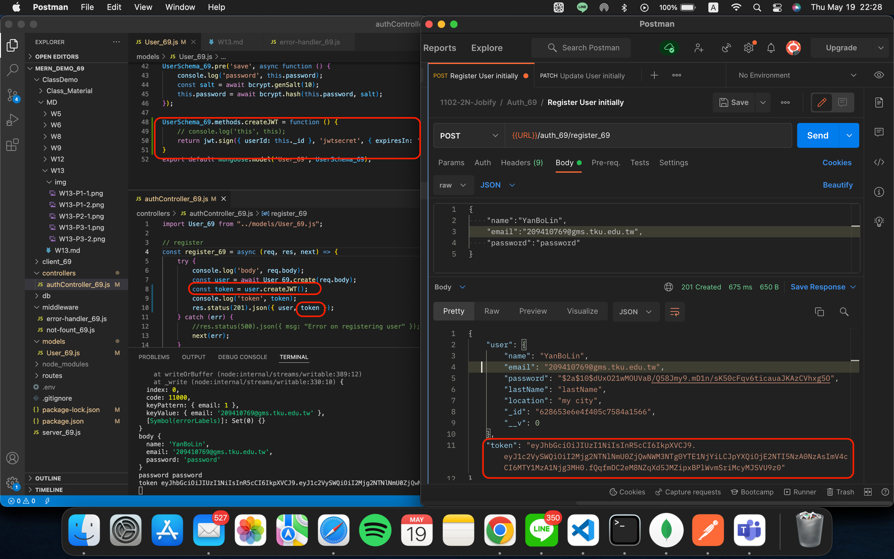
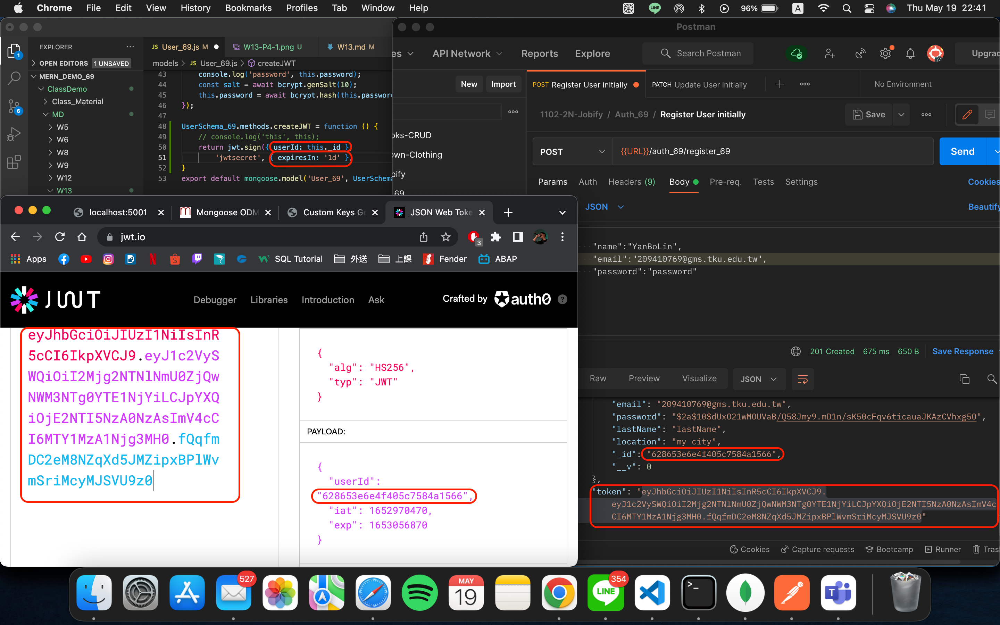

### Github repo URL
```
6480dcf 209410769       Thu May 19 22:46:57 2022 +0800  W13-P4: create jwt token using bcryptjs
f16ed88 209410769       Thu May 19 21:09:51 2022 +0800  W13-P3:Hash password using bcryptjs
66527f0 209410769       Thu May 19 20:29:17 2022 +0800  W13-P2:Use validator package to check email,error sent to error-handler_69.js
515907f 209410769       Thu May 19 19:36:18 2022 +0800  w13-P1:create a user and save it into MongoDB, collection User_69
```
### W13-P1:Create a user and save it into MongoDB, collection User_69



### W13-P2:Use validator package to check email,error sent to error-handler_69.js


### W13-P3:Hash password using bcryptjs



### W13-P4: create jwt token using bcryptjs


