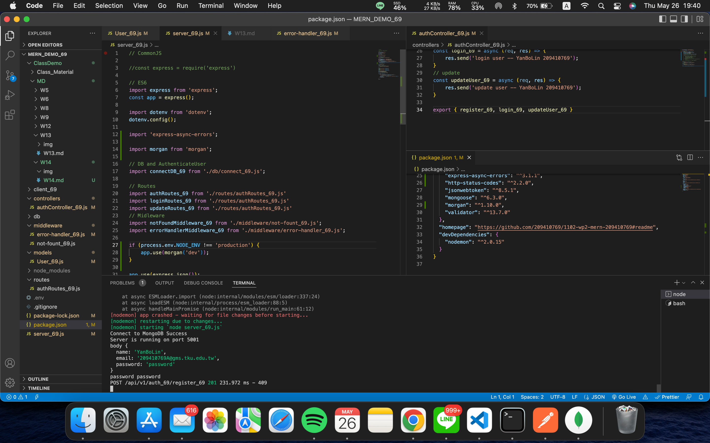
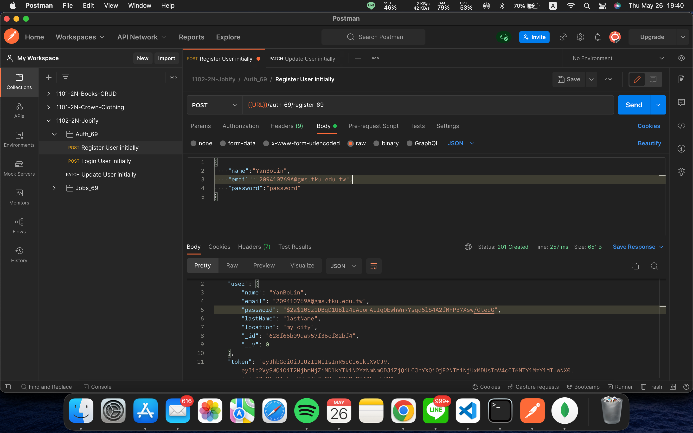
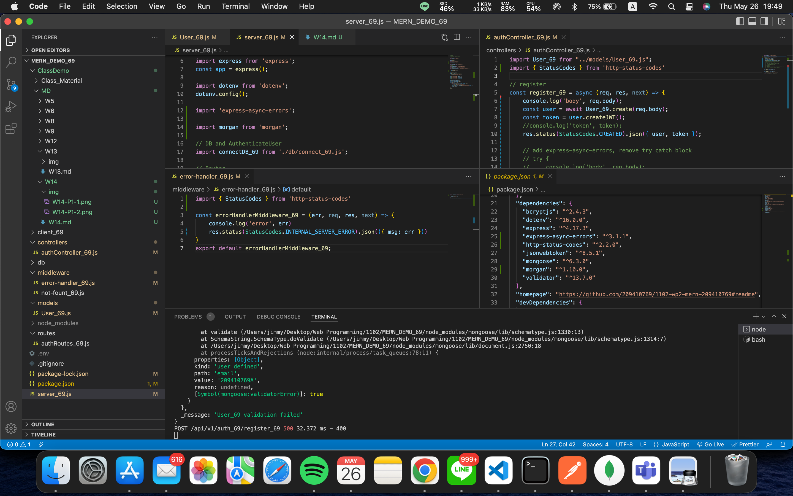
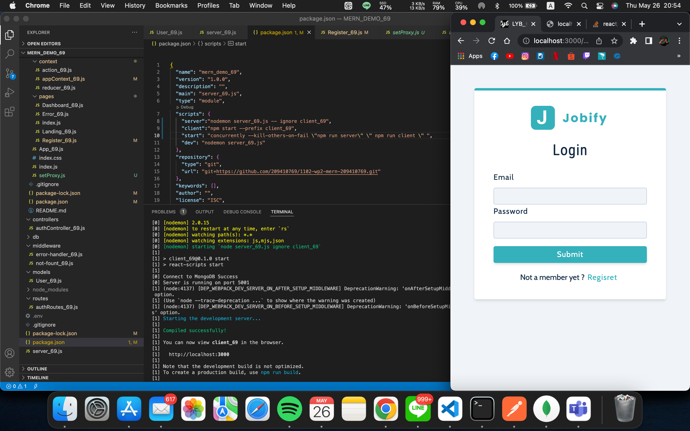
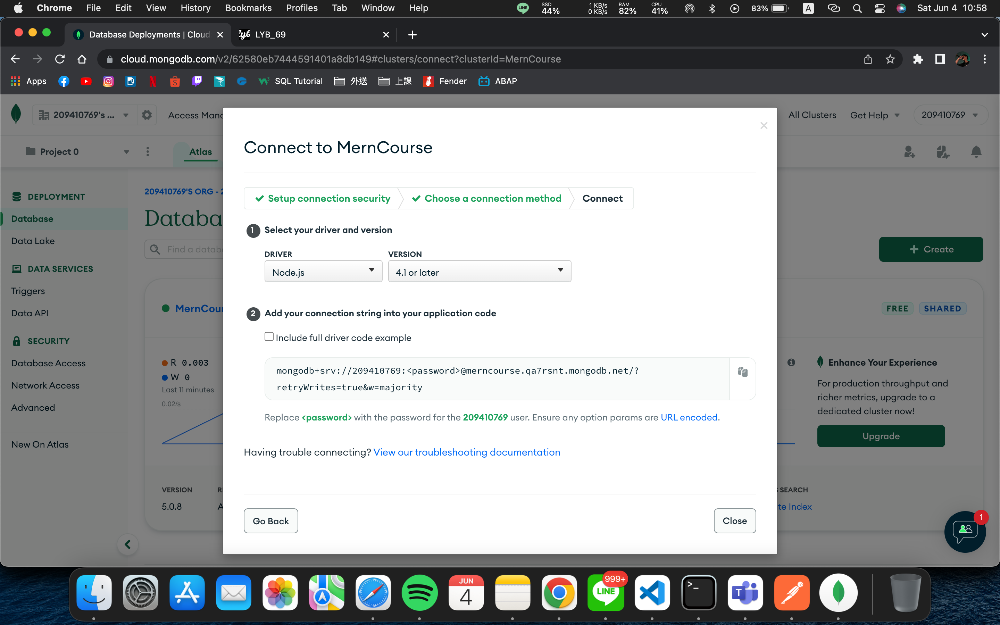

### W14-P1: Install package http-status-codes, morgan, test it, and show it


### W14-P2: Install express-async-errors and test it

### W14-P3: Run server and client concurrently

### W14-P4: Create mongodb atlas account


### W14-P5 Github Log
```

7447cb1 209410769       Sat Jun 4 11:02:25 2022 +0800   W14-P4: Create mongodb atlas account
faf9a14 209410769       Mon May 30 15:08:56 2022 +0800  W14-P3: run server and client concurrently
e5b74a5 209410769       Thu May 26 20:11:36 2022 +0800  W14-P1: install package http-status-codes, morgan, test it, and show it & W14-P2: install express-async-errors 
```