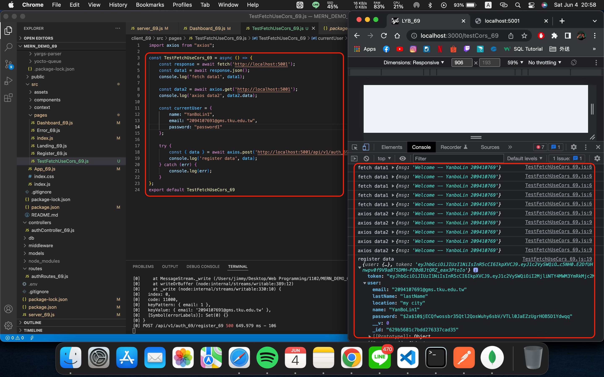
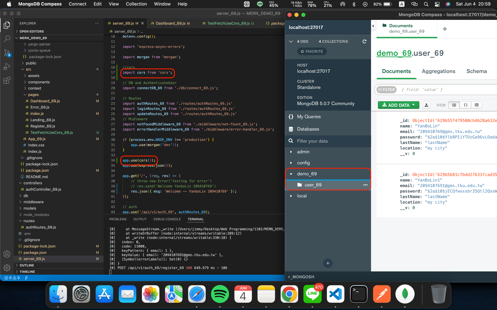
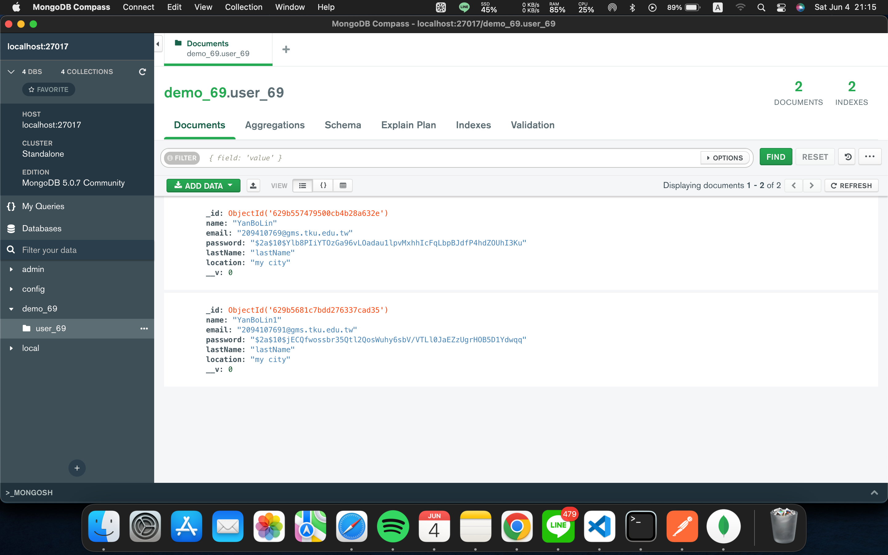
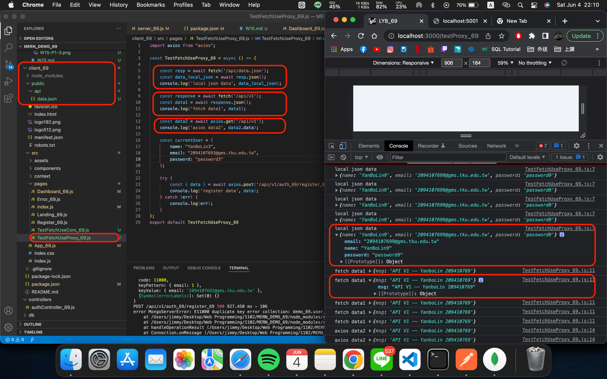
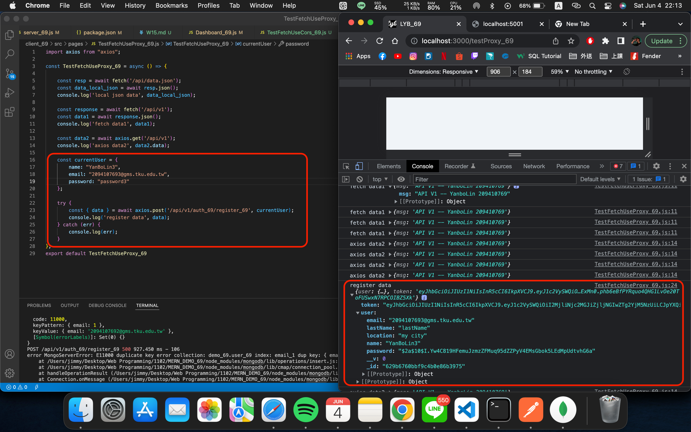
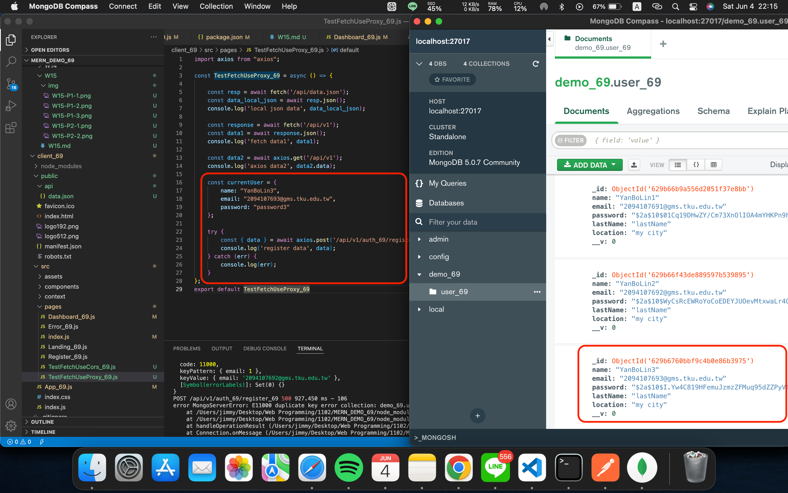

### W15-P1:Client / testcore to test TestFetchUseCors_69.js



### W15-P2:Client / testproxy to test TestFetchUseProxy_69.js




### GitHub Log
```
79d546f 209410769       Sat Jun 4 23:11:27 2022 +0800   TestFetchUseProxy_69.js run 1 times
ec7ad33 209410769       Sat Jun 4 23:11:05 2022 +0800   TestFetchUseProxy_69.js run 1 times
77e1702 209410769       Sat Jun 4 23:00:51 2022 +0800   TestFetchUseCors_69.js run 1 times
e431c0a 209410769       Sat Jun 4 22:18:07 2022 +0800   W15-P1:Client / testcore to test TestFetchUseCors_69.js &  W15-P2:Client / testproxy to test TestFetchUseProxy_69.js
```