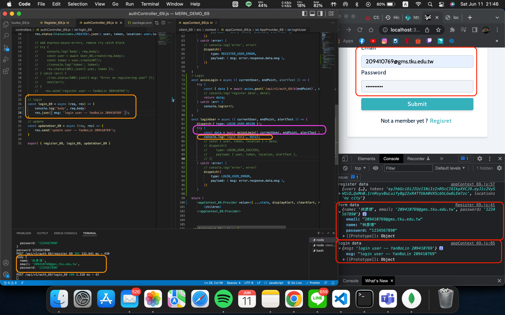
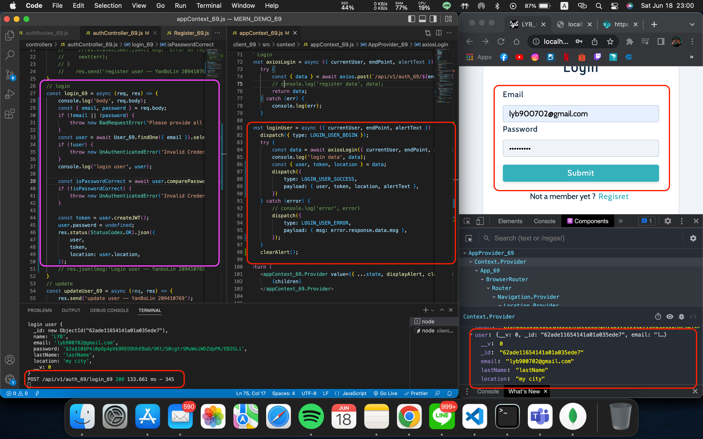

### W16-P1: RegisterUser Okay, Save {​ user, token, location}​ in appContext


### W16-P2: loginUser from client to server, test connection okay


### W16-P3: in server, check email and password for credentials, okay then return {user, token, location}

### Github Log
```
e0614fb 209410769       Sat Jun 18 23:02:53 2022 +0800  W16-P3: in server, check email and password for credentials, okay then return {user, token, location}
8cdd198 209410769       Sat Jun 11 21:56:06 2022 +0800  W16-P2: loginUser from client to server, test connection okay
eb30c83 209410769       Sat Jun 11 21:51:09 2022 +0800  W16-P2: loginUser from client to server, test connection okay
7a84ccd 209410769       Thu Jun 9 22:11:13 2022 +0800   W16-1 RegisterUser Okay, Save {​ user, token, location}​ in appContext
```