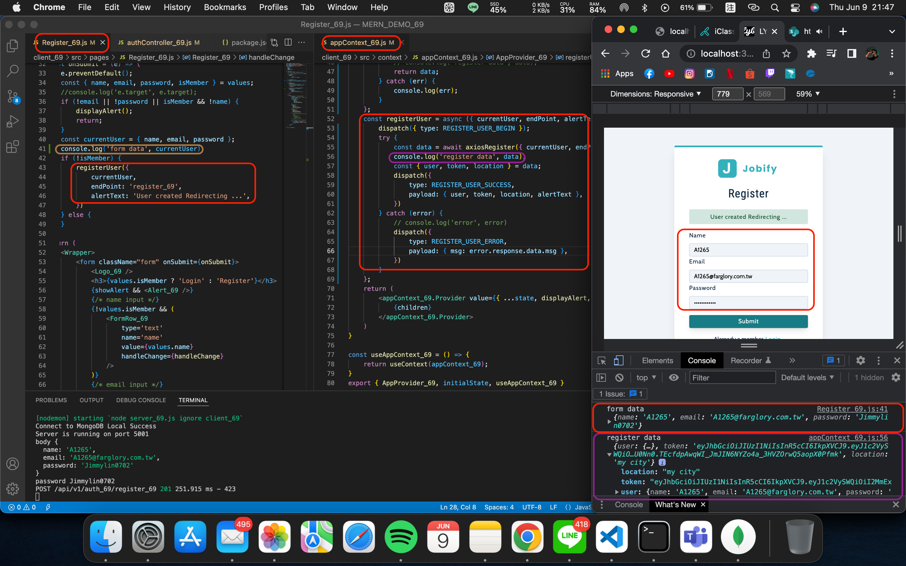
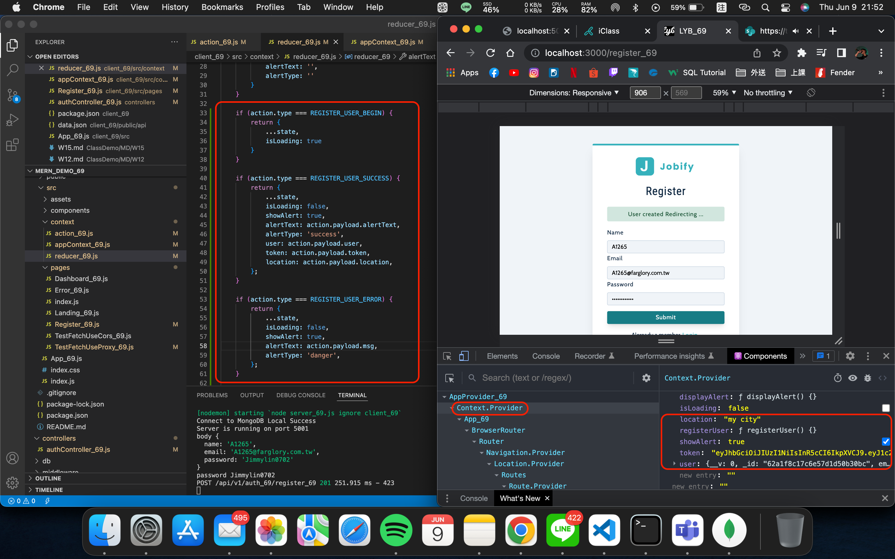

### W16-P1: RegisterUser Okay, Save {​ user, token, location}​ in appContext



### W16-P2: loginUser from client to server, test connection okay


### W16-P3: in server, check email and password for credentials, okay then return {user, token, location}

### Github Log
```
7a84ccd 209410769       Thu Jun 9 22:11:13 2022 +0800   W16-1 RegisterUser Okay, Save {​ user, token, location}​ in appContext
```