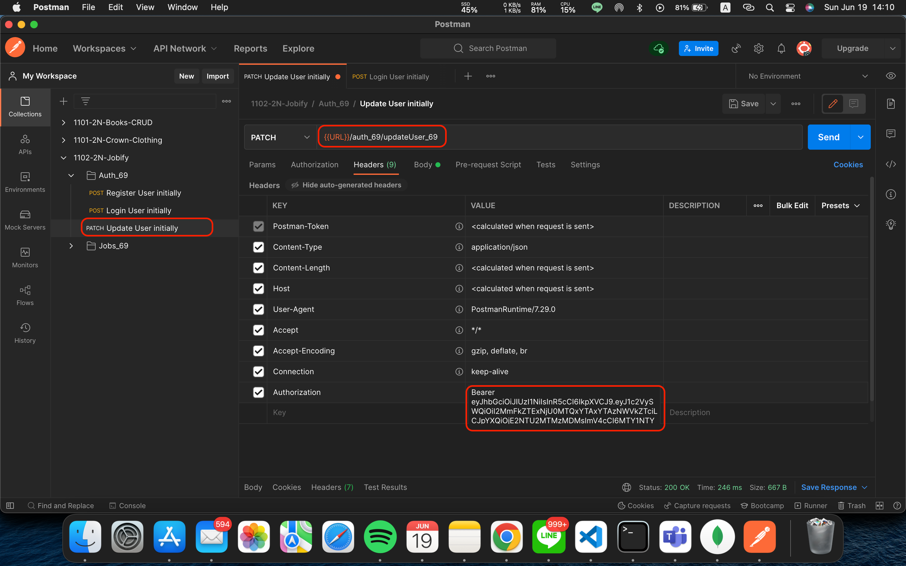
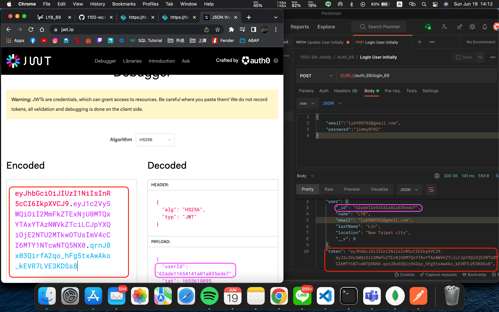
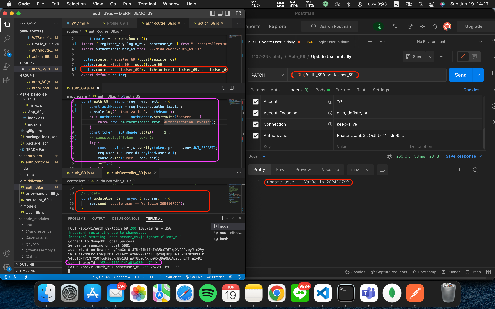
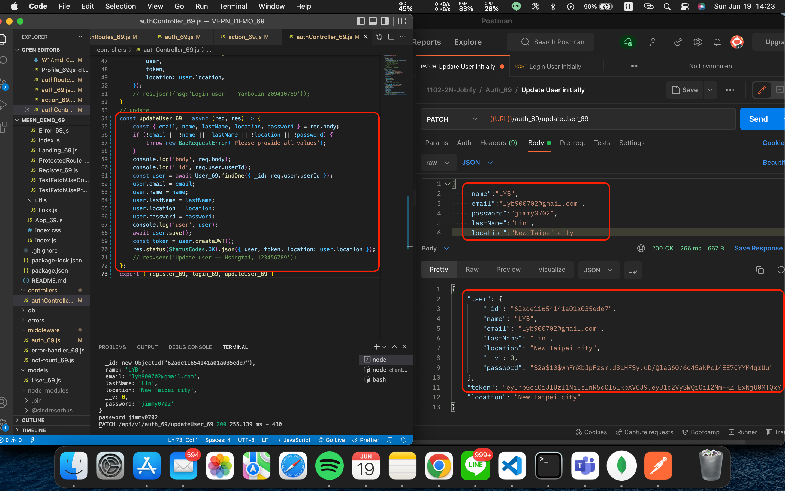

### W17-P1: after login in, direct to protected route of dashboard

### W17-P2: implement logout user, remove local stroage data


### W17-P3: toggle sidebar (SmallSidebar and BigSidebar)


### W17-P4: server authentication and updateUser





### GitHub Log
```
7962372 209410769       Sun Jun 19 14:25:39 2022 +0800  W17-P4: server authentication and updateUser
b0febaf 209410769       Sun Jun 19 13:51:02 2022 +0800  W17-P3: toggle sidebar (SmallSidebar and BigSidebar)
ec6036f 209410769       Sun Jun 19 13:19:41 2022 +0800  W17-P2: implement logout user, remove local stroage data
9e63cc9 209410769       Sun Jun 19 12:42:45 2022 +0800  W17-P1: after login in, direct to protected route of dashboard
```